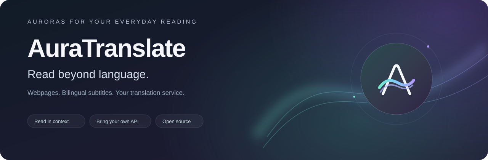
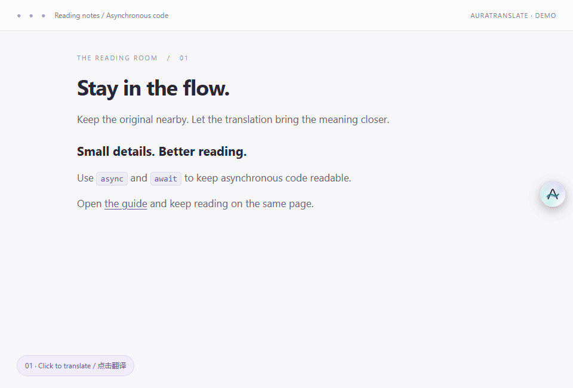
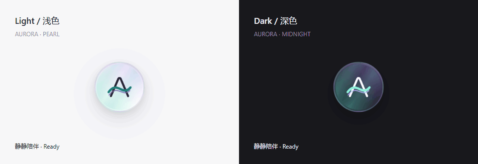
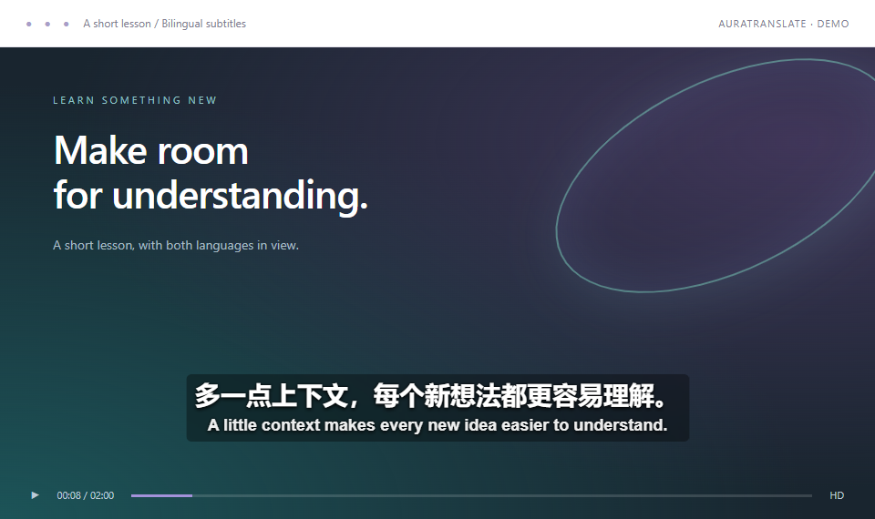
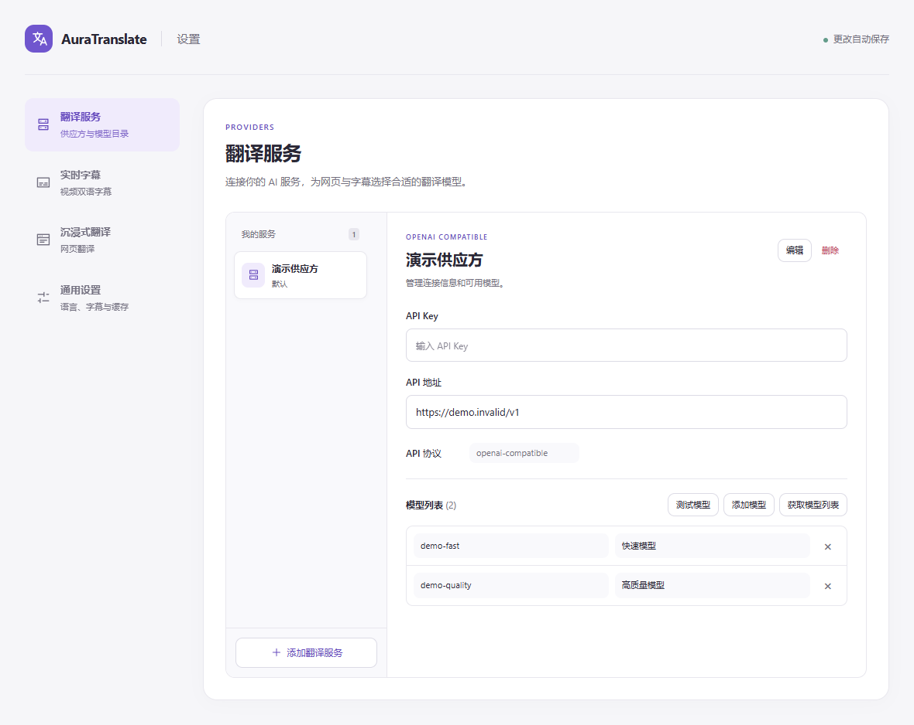
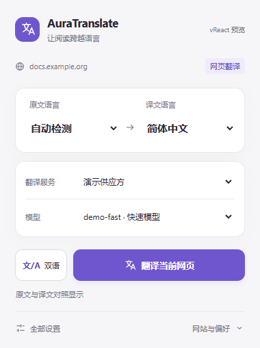

<div align="center">



[English](README.md) · **简体中文**

**看外文网页，追视频课程，让理解跟上阅读。**

AuraTranslate 是一款开源浏览器扩展，提供网页双语阅读与视频双语字幕。<br>
一颗极光小球，连接原文、译文和你选择的翻译服务。

[](LICENSE)


[看看效果](#看看效果) · [三步开始](#三步开始) · [常见问题](#常见问题) · [开发](#开发)

</div>

## 看看效果

### 原文就在身边，阅读不必来回切换

点击悬浮 **A**，译文出现在原文下方。读完后再点一下，就能隐藏或恢复已完成的译文。链接仍可点击，行内代码保持原样，标题、列表与常见排版保留原有结构。



*使用真实的网页提取、译文渲染和悬浮控件录制；文案及接口响应为演示数据，动图节奏不代表实际翻译速度。[查看静态截图](docs/assets/immersive-preview.png)。*

### 把一点极光，留在阅读的边缘

浅色页面用珠光白，深色页面用青紫黑。小球根据所在位置的页面背景自动适配；悬停时光带轻轻流动，翻译时亮起渐变光环。支持拖动、键盘操作和系统的减少动画偏好。



*此处为放大的控件展示，实际按钮大小为 44 px。[查看静态截图](docs/assets/aurora-preview.png)。*

### 视频课程，也能双语跟读

在支持的 **YouTube** 和 **Google Drive** 视频中，同时查看英文原文与中文译文。拖动即可调整字幕位置，也可以修改字号，选择简体或繁体中文。



*画面与字幕为演示素材，字幕由扩展实际叠加层渲染。AuraTranslate 翻译已有字幕或转写稿，不会为无字幕视频进行语音转写。*

## 阅读时用得上的细节

| 你想做的事 | AuraTranslate 的处理方式 |
| --- | --- |
| 先看懂眼前这一段 | 优先处理当前可见内容，匹配的缓存译文先显示。 |
| 随时对照原文 | 在双语对照、仅译文之间切换，复用已完成的翻译结果。 |
| 使用自己喜欢的模型 | 接入 OpenAI-compatible Chat Completions API，管理多个供应方与模型目录。 |
| 网页、字幕各选所需 | 网页翻译可沿用字幕服务，也可另选供应方与模型；网页还可使用免 Key 的 Google 翻译。 |
| 控制视频翻译范围 | 默认预翻译未来 **2 分钟**，可选 1 / 2 / 3 分钟，也可处理整片。 |
| 下次回来继续读 | 译文保存在本地；后续请求失败时，已完成的段落仍然保留。 |

## 三步开始

### 1. 加载扩展

[下载源码 ZIP](https://github.com/cai2761m/auratranslate/archive/refs/heads/main.zip) 并解压，或克隆仓库：

```sh
git clone https://github.com/cai2761m/auratranslate.git
```

在 **Chrome**（`chrome://extensions`）或 **Edge**（`edge://extensions`）中：

1. 开启 **开发者模式**。
2. 点击 **加载已解压的扩展程序**，选择包含 `manifest.json` 的文件夹。
3. 将 AuraTranslate 固定到工具栏，点击打开弹窗。

仓库已包含构建好的界面，**安装使用不需要 Node.js 或 npm**。

### 2. 选择翻译服务

**只想先试试网页翻译：** 在弹窗选择 **Google 翻译 · 免 Key**。该服务依赖网络可用性，也可能限流。

**使用自己的 AI 服务，或翻译视频字幕：** 打开 **设置 → 翻译服务**，点击 **添加自定义供应方**，填写：

| 字段 | 填写内容 |
| --- | --- |
| 供应方名称 | 一个方便辨认的名字 |
| API 地址 | 如 `https://api.example.com/v1`，替换为服务商的实际基础地址 |
| 密钥 | 你自己的 API Key |
| 模型目录 | 完整模型 ID；可设置显示名称、获取模型列表或测试模型 |

上述示例会请求 `https://api.example.com/v1/chat/completions`。请使用 **OpenAI-compatible Chat Completions** 接口，不要填写官网首页或其他协议的原生地址。



随后在 **实时字幕** 页面选择供应方和模型。**沉浸式翻译** 默认沿用字幕服务，也可单独选择。设置自动保存。扩展不附带 API Key 或接口额度，调用费用由服务商收取，模型测试及可选的 LLM 智能断句也可能产生调用费用。

### 3. 开始阅读或观看



- **普通网页：** 点击悬浮 A，或在弹窗选择语言与服务后点击 **翻译当前网页**。默认自动检测原文，翻译为简体中文。
- **显示方式：** 翻译按钮旁的图标可以切换双语对照与仅译文。
- **网站规则：** 展开 **更多功能**，选择跟随全局、自动翻译当前网站或不自动翻译。全局自动翻译默认关闭。
- **YouTube：** 打开带有英文字幕的视频，保持 **视频实时字幕** 开启。
- **Google Drive：** 打开具有可访问转写稿的视频。扩展会短暂打开转写面板读取文本，再恢复面板。

<br clear="all">

## 几个实用设置

| 设置项 | 默认值与可选范围 |
| --- | --- |
| 字幕语言 | 英语 → 简体中文，也支持繁体中文 |
| 翻译范围 | 默认省 token 模式，预翻译 2 分钟；可选 1 / 2 / 3 分钟或整片 |
| 字幕大小 | 默认 `1.00×`，可调范围 `0.30×–3.00×` |
| LLM 智能断句 | 默认开启；调用字幕 API，将零碎字幕组合成句子再翻译 |
| 字幕文本纠错 | 默认开启；让模型修正已有字幕中明显的识别错误 |
| 专业术语原文 | 默认开启；在中文译文中保留对应的原文术语 |
| JSON 输出模式 | 默认开启；接口不支持该选项时可关闭 |

## 常见问题

<details>
<summary><strong>支持哪些浏览器和视频来源？</strong></summary>

桌面 Chrome、Edge 可按上述方式加载源码。Manifest 还声明支持 Firefox 桌面版 **140+** 和 Firefox for Android **142+**。Firefox 常规安装需要经过 Mozilla 签名的扩展包，仓库源码 ZIP 并不是签名安装包。Android 使用范围是 Firefox 内的网页，不包括 YouTube 原生 App；不同设备和网站的表现可能存在差异。

视频翻译需要 YouTube 已有英文字幕，或 Google Drive 播放器能够提供转写稿。扩展没有录音或语音转写功能。

</details>

<details>
<summary><strong>刷新网页、切换显示方式，会重新翻译吗？</strong></summary>

匹配的成功译文会从本地缓存复用。切换双语 / 仅译文、隐藏 / 显示结果、修改字幕大小，不会重新请求翻译。更换模型、接口、语言或相关字幕处理设置，可能需要重新生成结果。缓存有容量限制，较旧的记录可能被淘汰。

如果网页请求发生结果不明的超时，扩展会检查晚到的缓存结果，不会自动重发该请求。已完成的段落继续保留；切回标签页可检查恢复情况，必要时手动继续缺失内容。已经发往服务商的请求仍可能完成并产生费用。

</details>

<details>
<summary><strong>部分内容没翻译，或接口报错怎么办？</strong></summary>

- 检查 API Key、完整模型 ID、基础地址和模型调用权限；接口拒绝 JSON 模式时关闭该选项。
- Google 翻译可能限流或不可用，可以改用自己配置的 AI 服务。
- 表单控件、代码块、装饰内容和明确排除的区域会跳过；图片、画布、嵌套框架或不支持的页面结构中的文字可能无法提取。
- 视频没有字幕时，先检查弹窗开关，以及视频是否提供支持的字幕轨道或转写稿。
- 更新后重新加载扩展，再刷新已打开的标签页。通常不必清缓存；需要舍弃旧译文或重新读取已更新的原始字幕时，再使用清空缓存功能。

</details>

<details>
<summary><strong>我的文本和 API Key 保存在哪里？</strong></summary>

无需注册 AuraTranslate 账号。字幕与网页文本会发送到你选择的翻译服务；LLM 智能断句也会将字幕文本发送到配置的接口。选择 Google 时，网页文本发送到 Google 公开翻译接口，请求不携带浏览器 Cookie。

设置、密钥、位置和缓存保存在浏览器扩展的本地存储中。**扩展没有对 API Key 额外加密**，密码输入框只遮挡显示内容。`storage` 权限用于保存本地数据；HTTP / HTTPS 网站访问权限用于读取页面文本、显示译文，以及连接你选择的 API，包括本地接口。

</details>

## 开发

弹窗与设置页使用 **React + esbuild**；内容脚本和翻译引擎使用原生 JavaScript。Node.js 版本需满足锁定的 jsdom 依赖要求：`^22.22.2`、`^24.15.0` 或 `>=26.0.0`。

```sh
npm ci
npm run build
npm test
npm run test:ui:browser
```

| 命令 / 目录 | 用途 |
| --- | --- |
| `npm run dev` | 监听 React 源码变动并重新构建 |
| `npm run preview` | 在 `http://127.0.0.1:5174` 预览界面，不调用真实 API |
| `npm run build:check` | 确认提交的 UI 产物与源码一致 |
| `npm run test:ui:browser` | 使用已安装的 Chrome 检查界面；设置 `UI_BROWSER=msedge` 可使用 Edge |
| `ui/` | React 弹窗、设置页与共享组件 |
| `src/` | 翻译、字幕、缓存、网页渲染与悬浮控件 |
| `test/` | 自动化测试与样例数据 |
| [图片与动图生成说明](docs/assets/README.md) | 重新生成本 README 的演示素材 |

请修改 React 源码，不要直接修改生成的 `options/options.js` 或 `popup/popup.js`，并将重新构建的产物一并提交。Windows 下若 PowerShell 阻止 `npm.ps1`，可改用 `npm.cmd`。浏览器预览和测试使用模拟存储及接口响应，真实 API 与设备验证需单独进行。

## 一起完善

遇到翻译不完整的页面？欢迎[提交 Issue](https://github.com/cai2761m/auratranslate/issues)，附上页面地址、浏览器及版本、复现步骤和错误文本。截图与日志中请移除 API Key 等私人信息。也欢迎提交聚焦的小修复、文档改进和可复现的样例。

本项目采用 [MIT 许可证](LICENSE)。
